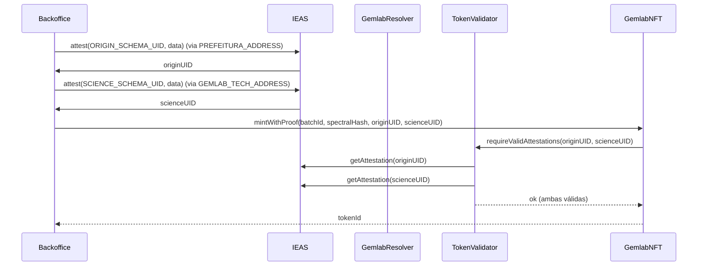
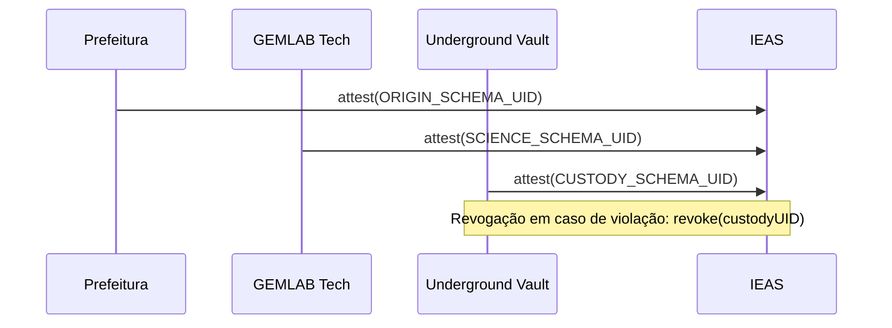

# Arquitetura GEMLAB + Ethereum Attestation Service (EAS)

## Visão Geral

O Protocolo GEMLAB estabelece uma infraestrutura de governança digital para Ativos do Mundo Real (RWA) Minerais, fundamentada em três camadas:
- Camada de Ativos (Tokens ERC-1155/ERC-721)
- Camada de Prova (EAS: Origem, Ciência, Custódia)
- Camada de Lógica de Negócio (RBAC, validações, liquidações fiscais)

Esta documentação especifica contratos, esquemas EAS, fluxo de mintagem condicional, integrações de backend/frontend e requisitos de segurança.

## Componentes On-Chain

- GemlabBatch.sol (ERC-1155)
- GemlabNFT.sol (ERC-721)
- GemlabMetadata.sol (tokenURI dinâmico)
- GemlabResolver.sol (EAS Resolver + RBAC)
- TokenValidator.sol (consulta de atestados e status de token)
- FiscalOracle.sol (liquidação fiscal CFEM/ISS + Fundo 2050)
- IEAS/SchemaRegistry.sol (contratos EAS)

## Schemas EAS

### ORIGIN_SCHEMA
- UID: ORIGIN_SCHEMA_UID
- Campos:
  - minerCNPJ: uint256
  - invoiceHash: bytes32
  - extractionDate: uint48
  - mineLocationID: string
- Attester: PREFEITURA_ADDRESS

### SCIENCE_SCHEMA
- UID: SCIENCE_SCHEMA_UID
- Campos:
  - spectralHash: bytes32
  - ramanSignature: string
  - qualityGrade: uint8
- Attester: GEMLAB_TECH_ADDRESS

### CUSTODY_SCHEMA
- UID: CUSTODY_SCHEMA_UID
- Campos:
  - vaultID: string
  - storageProof: bytes32
  - expirationTime: uint48
- Attester: UNDERGROUND_VAULT_ADDRESS

## Mapa de Dependências

- GemlabNFT → TokenValidator → IEAS
- GemlabResolver → IEAS (controle de quem pode atestar por schema)
- GemlabNFT → GemlabMetadata (URIs dinâmicos com UIDs EAS)
- Marketplace → TokenValidator/IEAS (verificação on-chain)
- FiscalOracle → integração de fluxo financeiro

## Assinaturas de Funções (Solidity)

```solidity
// GemlabBatch.sol (ERC-1155)
function mint(address to, uint256 batchId, uint256 amount, bytes data) external;
function split(uint256 batchId, uint256 amountA, uint256 amountB) external returns (uint256 newBatchIdA, uint256 newBatchIdB);
function merge(uint256 batchIdA, uint256 batchIdB) external returns (uint256 mergedBatchId);

// GemlabNFT.sol (ERC-721)
function mintWithProof(
  uint256 originBatchId,
  bytes32 spectralHash,
  bytes32 originUID,
  bytes32 scienceUID
) external returns (uint256 tokenId);
function pauseToken(uint256 tokenId) external;
function setCustodyUID(uint256 tokenId, bytes32 custodyUID) external;

// GemlabMetadata.sol
function tokenURI(uint256 tokenId) public view returns (string memory);

// GemlabResolver.sol
function registerResolver(bytes32 schemaUID) external;
function setRole(bytes32 schemaUID, address attester) external;
function canAttest(bytes32 schemaUID, address attester) public view returns (bool);

// TokenValidator.sol
function requireValidAttestations(bytes32 originUID, bytes32 scienceUID) external view;
function getStatus(uint256 tokenId) external view returns (uint8 status);
function getAttestations(uint256 tokenId) external view returns (bytes32 originUID, bytes32 scienceUID, bytes32 custodyUID);

// FiscalOracle.sol
function onTrade(uint256 tokenId, uint256 priceWei) external returns (uint256 taxCFEMWei, uint256 taxISSWei, uint256 fund2050Wei);
```

## RBAC e Resolver (EAS)

- GemlabResolver é cadastrado como resolver para os três schemas.
- Enforce de RBAC:
  - ORIGIN_SCHEMA → PREFEITURA_ADDRESS
  - SCIENCE_SCHEMA → GEMLAB_TECH_ADDRESS
  - CUSTODY_SCHEMA → UNDERGROUND_VAULT_ADDRESS
- `canAttest(schemaUID, msg.sender)` deve retornar true antes de `EAS.attest`

## Fluxo Crítico: Mintagem Condicional



## Emissão e Revogação de Atestados



Estados sugeridos do Token:
- Legal: Origem + Ciência válidos; Custódia opcional
- Risco: Custódia revogada/expirada; `pauseToken(tokenId)` ou flag de risco
- Inválido: Falta Origem/Ciência válidos; mint e transfer restritos

## Backend: Emissão com EAS SDK

```ts
import { EAS, SchemaEncoder } from "@ethereum-attestation-service/eas-sdk";
import { ethers } from "ethers";

const provider = new ethers.JsonRpcProvider(process.env.RPC_URL);
const signer = new ethers.Wallet(process.env.ATTESTER_PRIVATE_KEY!, provider);

const eas = new EAS("0xC2679fBD37d54388Ce493F1DB75320D236e1815e"); // Sepolia
eas.connect(signer);

// ORIGIN
const originEncoder = new SchemaEncoder(
  "uint256 minerCNPJ, bytes32 invoiceHash, uint48 extractionDate, string mineLocationID"
);
const originData = originEncoder.encodeData([
  { name: "minerCNPJ", value: 12345678901234n, type: "uint256" },
  { name: "invoiceHash", value: "0x...", type: "bytes32" },
  { name: "extractionDate", value: 1733700000, type: "uint48" },
  { name: "mineLocationID", value: "CV-MINE-01", type: "string" },
]);
const originTx = await eas.attest({ schema: ORIGIN_SCHEMA_UID, data: originData });
const originReceipt = await originTx.wait();
const originUID = originReceipt.uid;

// SCIENCE
const scienceEncoder = new SchemaEncoder(
  "bytes32 spectralHash, string ramanSignature, uint8 qualityGrade"
);
const scienceData = scienceEncoder.encodeData([
  { name: "spectralHash", value: "0x...", type: "bytes32" },
  { name: "ramanSignature", value: "Raman:532nm;Power:5mW", type: "string" },
  { name: "qualityGrade", value: 1, type: "uint8" },
]);
const scienceTx = await eas.attest({ schema: SCIENCE_SCHEMA_UID, data: scienceData });
const scienceUID = (await scienceTx.wait()).uid;
```

## Frontend: Integração e Exibição

- EASVerificationBadge.tsx: renderiza estado dos atestados e links de explorer
- QRVerificationSystem.tsx: exibe dados públicos do certificado e status
- OracleFiscalDashboard.tsx: logs do processo de atestação (simulação)

## Deploy: Hardhat (Sepolia)

```bash
npm install --save-dev hardhat @nomicfoundation/hardhat-toolbox
npx hardhat init
```

Script de deploy (exemplo):

```ts
import { ethers } from "hardhat";

async function main() {
  const Batch = await ethers.getContractFactory("GemlabBatch");
  const batch = await Batch.deploy();
  await batch.waitForDeployment();

  const NFT = await ethers.getContractFactory("GemlabNFT");
  const nft = await NFT.deploy(/* deps */);
  await nft.waitForDeployment();

  const Resolver = await ethers.getContractFactory("GemlabResolver");
  const resolver = await Resolver.deploy();
  await resolver.waitForDeployment();

  // Registrar resolver nos schemas (pré-registrados via SchemaRegistry)
}

main().catch((e) => { console.error(e); process.exit(1); });
```

## Roadmap (6 Sprints)

1. Especificação e Schemas EAS
2. Implementação GemlabBatch + GemlabNFT + Metadata
3. GemlabResolver + RBAC + Registro de resolver
4. TokenValidator + integração IEAS + testes
5. FiscalOracle + eventos de liquidação + integração frontend
6. Deploy Sepolia + scripts + documentação e exemplos de backend

## Métricas e Auditoria

- Eventos: `MintedWithProof`, `Settlement`, `AttestationLinked`
- Logs: Registro de UIDs, hashes e sequências em auditoria
- Consultas: GraphQL EAS (`https://sepolia.easscan.org/graphql`) para biografia jurídica

## Considerações de Segurança

- RBAC estrito no resolver por schema
- Validação de `attester`, `schemaUID` e `revocationTime == 0`
- Pausa/risco com base em custódia
- Integração com KYC/AML (ERC-3643/1400) opcional para gatekeeping de liquidez

## Referências de Código no Projeto

- Endereço EAS (Sepolia): `src/components/oracle/OracleFiscalDashboard.tsx:177`
- Tooltip EAS e verificação: `src/components/verification/EASVerificationBadge.tsx:151`
- Processo de emissão (simulado): `src/components/oracle/OracleFiscalDashboard.tsx:167–239`

